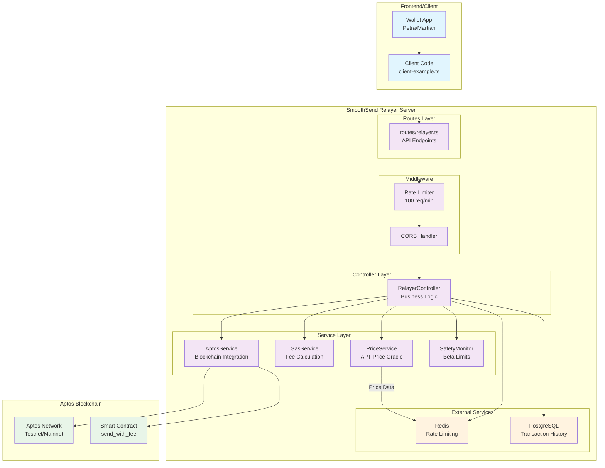
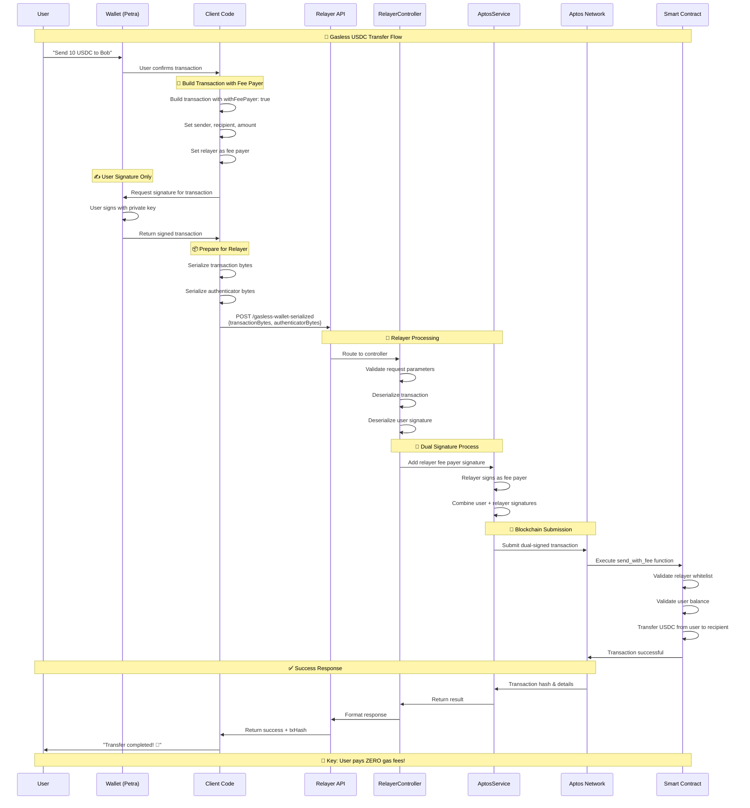
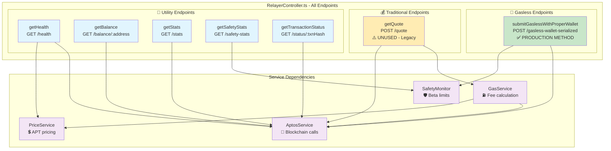
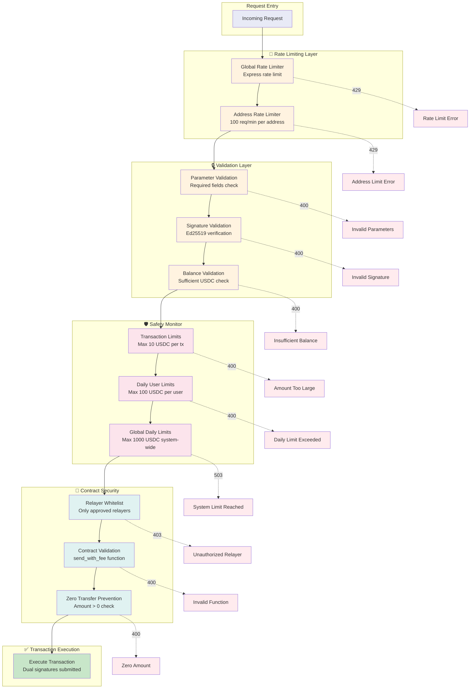
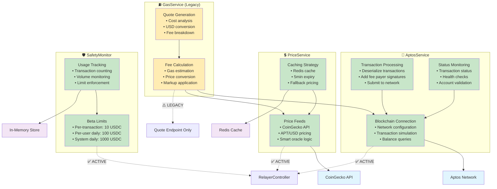
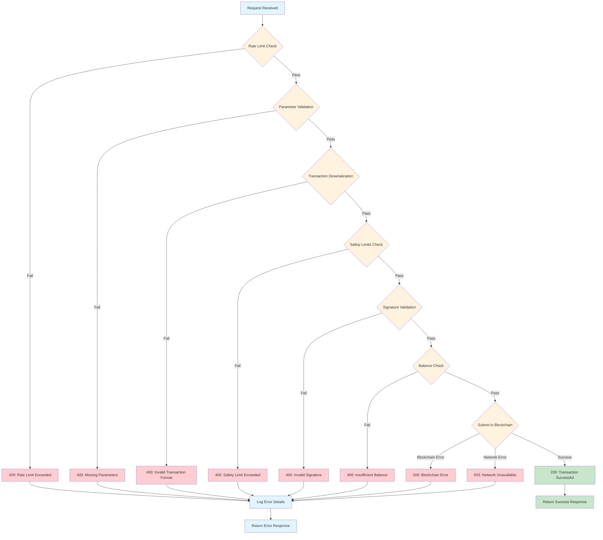
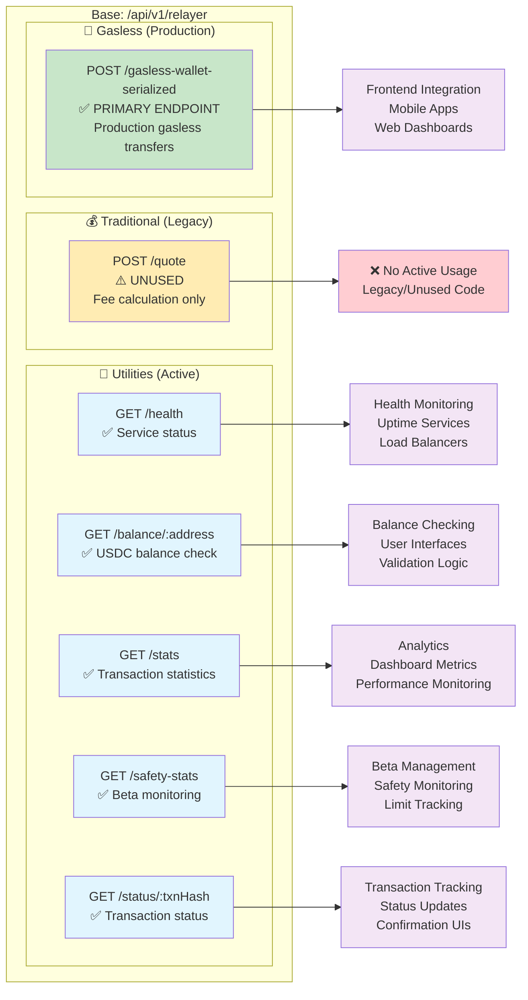

# 🔄 SmoothSend Code Flow Diagrams

## 📊 Complete System Architecture



## 🚀 Gasless Transaction Flow (Primary Path)



## 🏗️ Controller Architecture Deep Dive



## 🔐 Transaction Serialization Process

```mermaid
graph LR
    subgraph "Client Side"
        subgraph "1️⃣ Transaction Building"
            TB[Build Raw Transaction<br/>• Sender address<br/>• Recipient address<br/>• Amount (USDC)<br/>• withFeePayer: true]
        end
        
        subgraph "2️⃣ User Signing"
            US[User Signs Transaction<br/>• Wallet private key<br/>• Ed25519 signature<br/>• Creates authenticator]
        end
        
        subgraph "3️⃣ Serialization"
            SER[Serialize Both<br/>• Transaction → bytes[]<br/>• Authenticator → bytes[]<br/>• Send to relayer]
        end
    end
    
    subgraph "Server Side"
        subgraph "4️⃣ Deserialization"
            DES[Deserialize Data<br/>• bytes[] → Transaction<br/>• bytes[] → Authenticator<br/>• Validate structure]
        end
        
        subgraph "5️⃣ Fee Payer Signing"
            FPS[Add Relayer Signature<br/>• Relayer private key<br/>• Signs as fee payer<br/>• Creates fee payer auth]
        end
        
        subgraph "6️⃣ Submission"
            SUB[Submit to Aptos<br/>• Dual signatures<br/>• User + Fee Payer<br/>• No sequence conflicts]
        end
    end
    
    TB --> US
    US --> SER
    SER --> DES
    DES --> FPS
    FPS --> SUB
    
    %% Benefits
    SUB --> BEN1[✅ No Race Conditions]
    SUB --> BEN2[✅ Universal Wallet Support]
    SUB --> BEN3[✅ Proper Security]
    
    %% Styling
    classDef client fill:#e3f2fd
    classDef server fill:#f1f8e9
    classDef benefit fill:#c8e6c9
    
    class TB,US,SER client
    class DES,FPS,SUB server
    class BEN1,BEN2,BEN3 benefit
```

## 🛡️ Security & Safety Flow



## 📊 Service Layer Interactions



## 🔄 Error Handling Flow



## 🎯 API Endpoint Map



---

## 💡 Key Insights from Diagrams

### 🎯 **Primary Flow**: 
The gasless transaction flow using transaction serialization is the core production feature.

### ⚠️ **Legacy Code**: 
The quote endpoint and gas calculation service are unused legacy components.

### 🛡️ **Security Layers**: 
Multiple validation and safety layers protect the system at different levels.

### 🔄 **Clean Architecture**: 
Clear separation between routes, controllers, services, and external dependencies.

### 📊 **Monitoring Ready**: 
Comprehensive utility endpoints for health monitoring and analytics.

*Generated: September 3, 2025*
