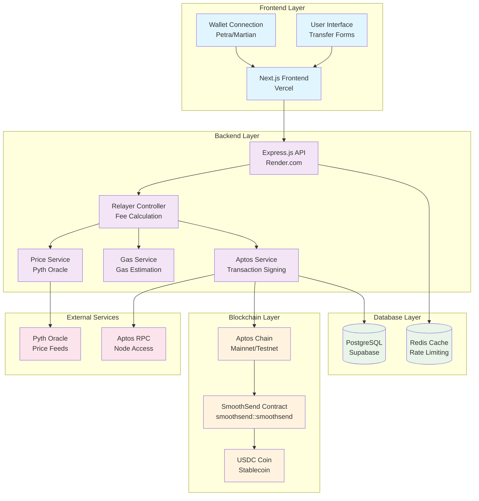
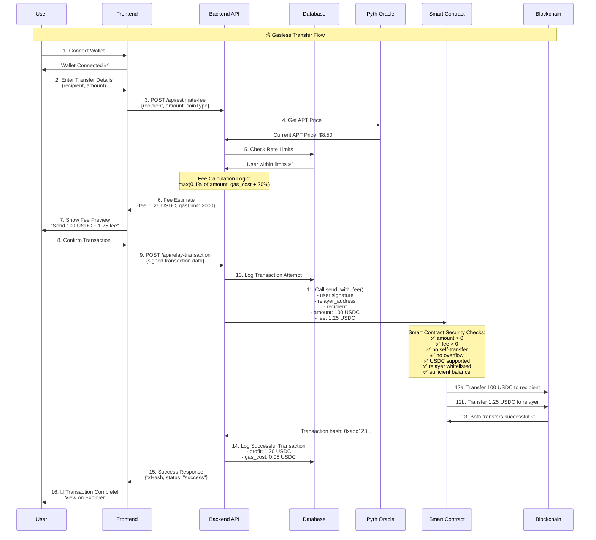
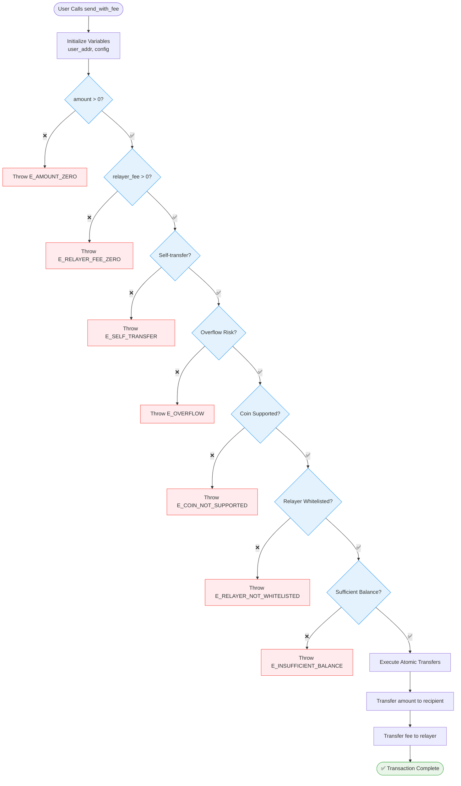
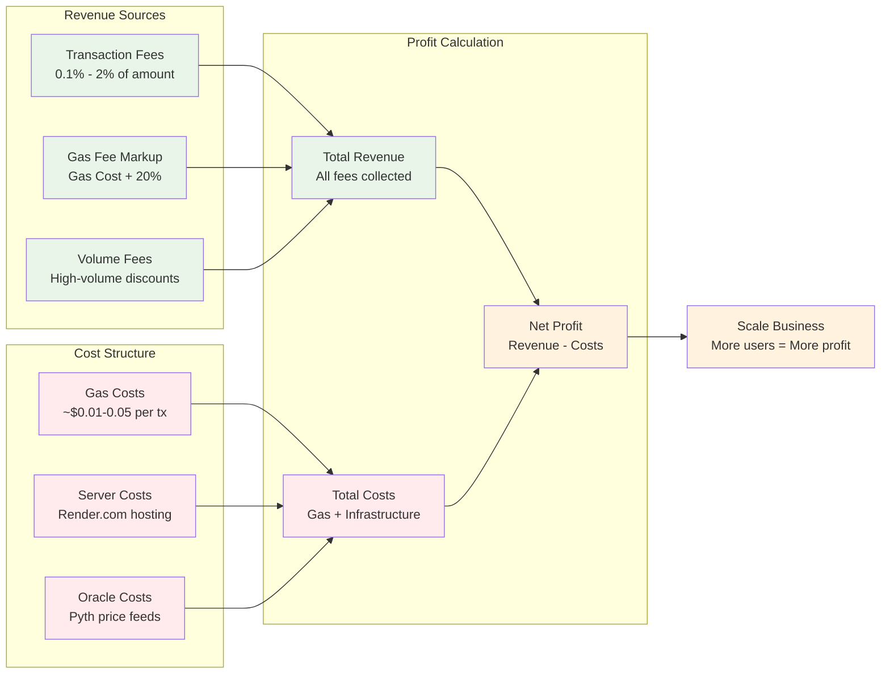
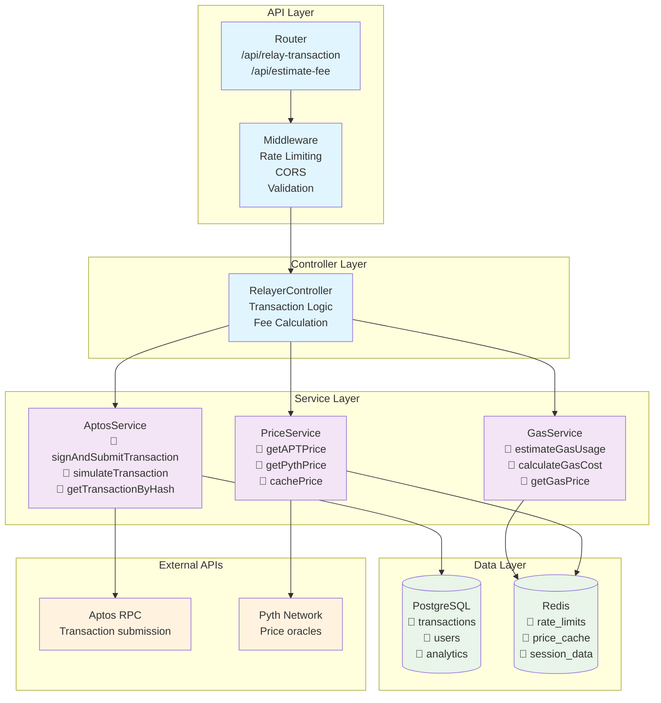
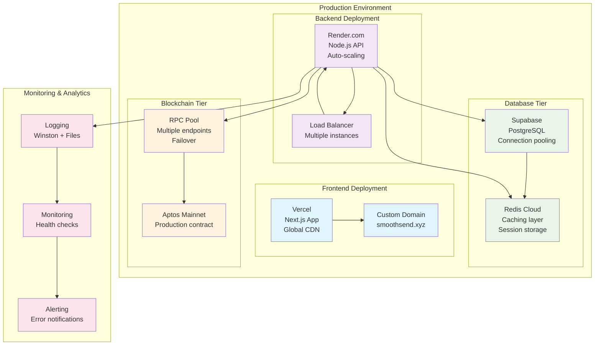
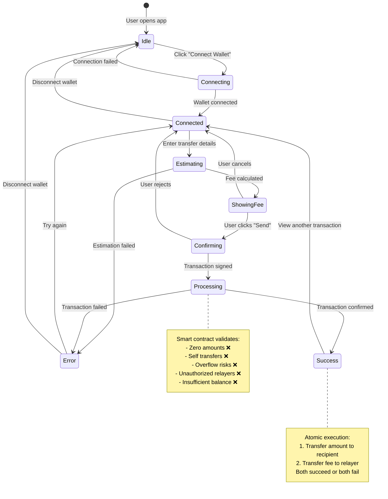

# 🎯 SmoothSend DApp Architecture & Flow Diagrams

## 🏗️ **1. Overall System Architecture**

## 🔄 **2. Complete Transaction Flow**

## 🛡️ **3. Smart Contract Security Flow**

## 💰 **4. Business Model & Profit Flow**

## 🔧 **5. Backend Service Architecture**

## 🚀 **6. Deployment & Scaling Architecture**

## 📊 **7. Data Flow & State Management**

---

## 🎯 **Key Insights from These Diagrams:**

### **🔒 Security Layers:**
1. **Frontend:** Wallet signature validation
2. **Backend:** Rate limiting, input validation  
3. **Smart Contract:** 7 security checks before execution
4. **Blockchain:** Immutable transaction recording

### **💰 Profit Optimization:**
- **High-margin transactions** (98%+ profit on current testnet)
- **Predictable costs** (gas + infrastructure)
- **Scalable revenue** (more users = more profit)

### **🚀 Performance Architecture:**
- **CDN-delivered frontend** (global speed)
- **Auto-scaling backend** (handles traffic spikes)
- **Cached price data** (faster fee calculations)
- **Connection pooling** (database efficiency)

### **🛡️ Failure Resilience:**
- **Atomic transactions** (all-or-nothing transfers)
- **RPC failover** (multiple Aptos endpoints)
- **Error monitoring** (instant alert system)
- **Database backups** (data protection)

**Your SmoothSend DApp is production-ready for scale! 🚀**
